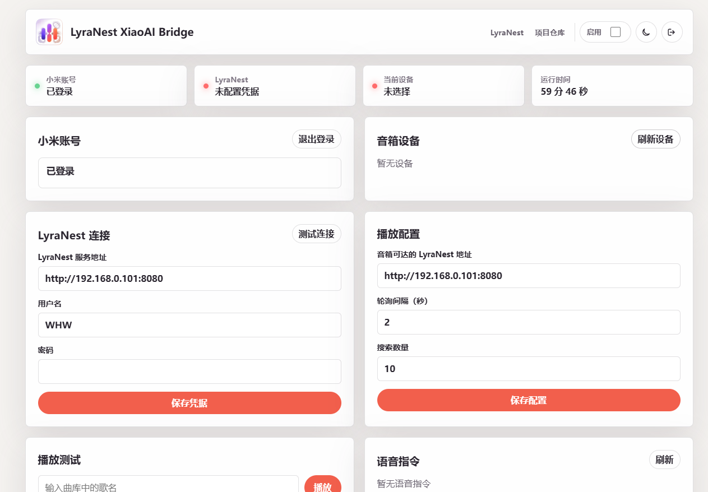

# LyraNest XiaoAI Bridge

<p align="center">
  <strong>让小爱音箱播放你的 LyraNest 私人音乐库。</strong>
</p>

<p align="center">
  <a href="https://github.com/WHWgogogo/LyraNest-Xiaomi-Bridge/releases/latest"></a>
  <a href="https://github.com/WHWgogogo/LyraNest-Xiaomi-Bridge/releases/latest"></a>
  <a href="https://lyranest.dpdns.org/"></a>
</p>

<p align="center">
  <a href="https://github.com/WHWgogogo/LyraNest-Xiaomi-Bridge/releases/latest">下载最新版</a> ·
  <a href="https://lyranest.dpdns.org/">LyraNest 官网</a> ·
  <a href="https://github.com/WHWgogogo/LyraNest">LyraNest 主项目</a> ·
  <a href="#飞牛-fnos-安装">飞牛安装</a> ·
  <a href="#docker-离线部署">Docker 部署</a>
</p>

<p align="center">
  
</p>

LyraNest（律巢）是一套面向个人 NAS、家庭服务器与局域网音乐库的自托管音乐服务。LyraNest XiaoAI Bridge 是它的音箱扩展：将一台小爱音箱连接到你的 LyraNest 服务后，就可以用语音搜索并播放自己曲库中的音乐。

当前稳定版本：`1.0.1`

## 下载最新版

请前往 [GitHub 最新发行版](https://github.com/WHWgogogo/LyraNest-Xiaomi-Bridge/releases/latest) 下载对应文件。以下链接始终指向当前稳定发行：

| 文件 | 下载 | 适用场景 |
| --- | --- | --- |
| `LyraNest-XiaoAI-Bridge-1.0.1-fnos-native.fpk` | [下载 FPK](https://github.com/WHWgogogo/LyraNest-Xiaomi-Bridge/releases/latest/download/LyraNest-XiaoAI-Bridge-1.0.1-fnos-native.fpk) | 飞牛 fnOS 原生应用安装包 |
| `LyraNest-XiaoAI-Bridge-1.0.1-docker-image-linux-amd64.tar` | [下载 Docker 镜像](https://github.com/WHWgogogo/LyraNest-Xiaomi-Bridge/releases/latest/download/LyraNest-XiaoAI-Bridge-1.0.1-docker-image-linux-amd64.tar) | Linux AMD64 / x86_64 离线 Docker 部署 |
| `SHA256SUMS-1.0.1.txt` | [下载校验文件](https://github.com/WHWgogogo/LyraNest-Xiaomi-Bridge/releases/latest/download/SHA256SUMS-1.0.1.txt) | 校验下载完整性 |

## 它能做什么

- 登录小米账号并发现局域网中的小爱音箱。
- 在管理台选择要控制的音箱，完成 LyraNest 服务连接。
- 将“播放某首歌”“下一首”“暂停”“停止”等语音请求转成曲库操作。
- 由音箱直接访问 LyraNest 的音乐流，Bridge 不转发音频数据。
- 提供播放测试、连接状态和最近语音指令记录，方便日常排查。

## 它和 LyraNest 的关系

LyraNest 负责保存音乐、搜索曲库、管理账号并提供播放地址；XiaoAI Bridge 负责把这些能力带给小爱音箱。它是一个独立安装、独立更新的配套应用，不会替代 LyraNest 主服务。

使用前，请先部署可正常访问的 [LyraNest](https://github.com/WHWgogogo/LyraNest)。小爱音箱也必须能通过局域网访问你在 Bridge 中填写的 LyraNest 地址。

## 飞牛 fnOS 安装

飞牛 NAS 用户推荐安装 FPK：

1. 下载 [LyraNest XiaoAI Bridge 1.0.1 FPK](https://github.com/WHWgogogo/LyraNest-Xiaomi-Bridge/releases/latest/download/LyraNest-XiaoAI-Bridge-1.0.1-fnos-native.fpk)。
2. 在飞牛应用中心选择手动安装，上传 FPK 并完成安装。
3. 在应用设置中选择未被占用的访问端口，默认是 `18090`。
4. 从飞牛桌面打开应用，首次进入创建 6 位数字访问口令。
5. 登录小米账号，选择音箱，填写 LyraNest 服务地址后保存配置。

飞牛桌面入口使用飞牛统一网关；你也可以通过 `http://<飞牛地址>:<端口>` 从局域网访问管理台。

## Docker 离线部署

Docker 镜像适用于 Linux AMD64 / x86_64 设备，与飞牛 FPK 是两种独立的安装方式。下载镜像并导入：

```bash
docker load -i LyraNest-XiaoAI-Bridge-1.0.1-docker-image-linux-amd64.tar
```

启动 Bridge：

```bash
docker run -d --name lyranest-xiaoai-bridge \
  --restart unless-stopped \
  -p 18090:8090 \
  -v /vol1/1000/lyranest-xiaoai-bridge/data:/data \
  -e TZ=Asia/Shanghai \
  lyranest-xiaoai-bridge:1.0.1
```

然后在浏览器打开 `http://<NAS_IP>:18090`，完成首次设置即可。Docker 方式不使用飞牛统一网关。

## 首次配置

1. 创建管理台的 6 位数字访问口令。
2. 输入小米账号和密码；小米要求时，再输入短信或邮箱验证码。
3. 刷新并选择一台小爱音箱。
4. 填写 Bridge 访问 LyraNest 的服务地址，以及音箱可访问的 LyraNest 地址。
5. 保存配置并启用 Bridge，随后可用“播放测试”验证全链路。

“LyraNest 服务地址”供 Bridge 搜索音乐；“音箱可达的 LyraNest 地址”供音箱直接播放。两者在反向代理、多网卡或跨主机部署时可能不同。

## 使用提示

- 当前支持单账号、单音箱，适合家庭和个人局域网使用。
- 小爱相关连接基于非官方兼容能力；小米账号风控、验证要求或服务调整可能需要重新登录。
- 配置和已加密的小米登录会话保存在数据目录；请不要删除 Docker 数据卷或飞牛应用数据。
- 管理台口令仅适合可信局域网。请勿将端口直接暴露到互联网；远程使用时建议通过防火墙或带认证的反向代理保护。

## 校验下载

Linux、macOS：

```bash
sha256sum -c SHA256SUMS-1.0.1.txt
```

Windows PowerShell：

```powershell
Get-FileHash .\LyraNest-XiaoAI-Bridge-1.0.1-fnos-native.fpk -Algorithm SHA256
Get-FileHash .\LyraNest-XiaoAI-Bridge-1.0.1-docker-image-linux-amd64.tar -Algorithm SHA256
```

## 相关链接

- [LyraNest 官网](https://lyranest.dpdns.org/)
- [LyraNest 主项目](https://github.com/WHWgogogo/LyraNest)
- [LyraNest XiaoAI Bridge 最新下载](https://github.com/WHWgogogo/LyraNest-Xiaomi-Bridge/releases/latest)

> 本仓库提供 LyraNest XiaoAI Bridge 的正式安装包、校验文件和使用说明，不包含完整源代码。
